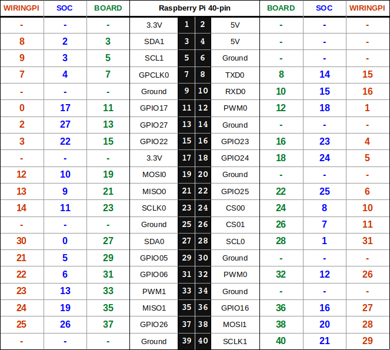
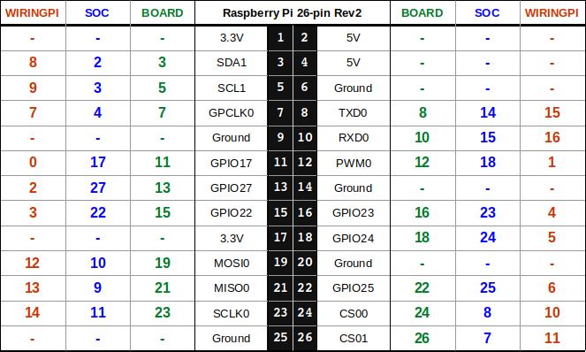
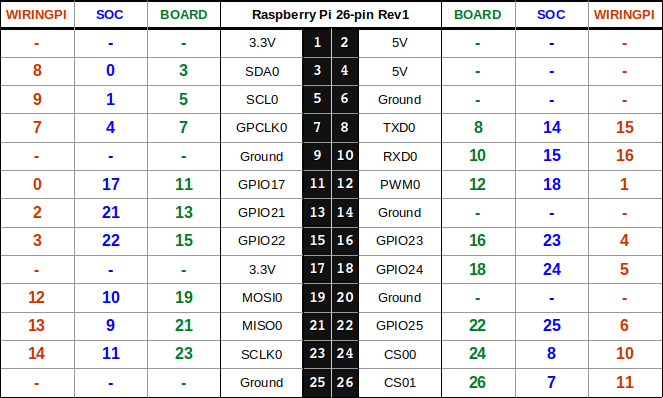

############
Raspberry Pi
############

The GPIO module supports all Raspberry Pi models up to the 3B+, but not all models
have been tested. If you encounter any problems or errors, please open a new issue
and post your logs.

.. admonition:: Don't forget to install the requirements

    .. code-block:: shell

        pip3 install -r requirements/gpio-rpi.txt

Pin Numbering
=============

40-pin
------

26-pin Rev2
-----------

26-pin Rev1
-----------

